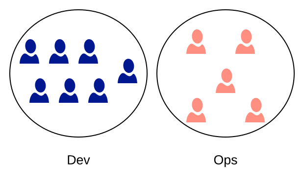
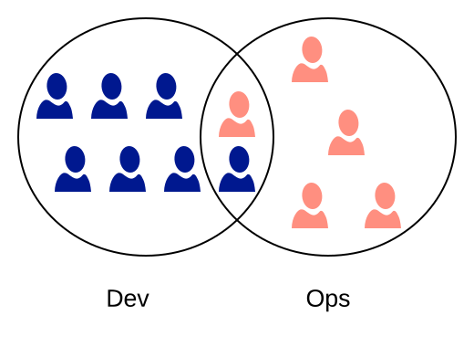
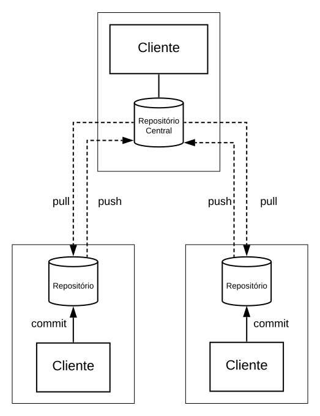
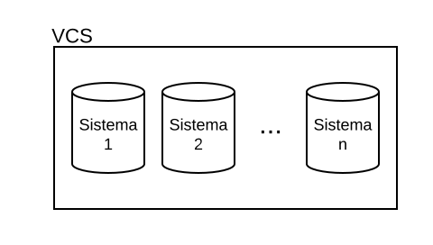
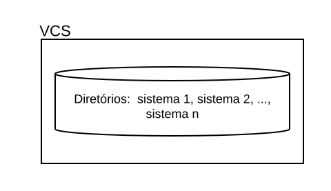
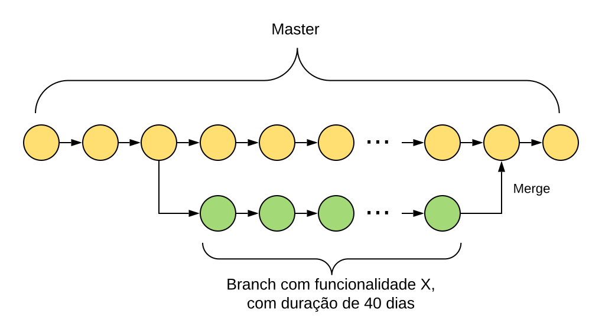
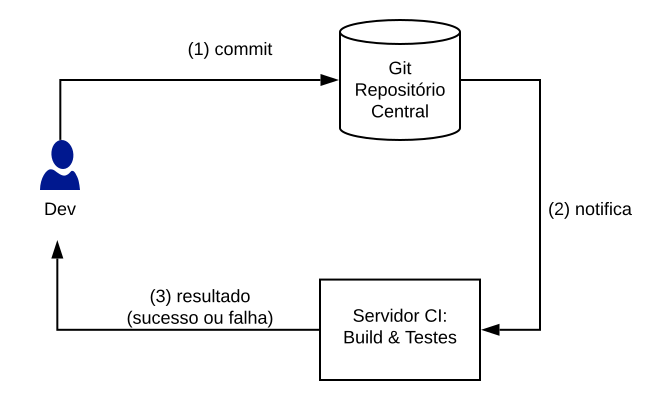

# Cap. 10 - DevOps (em andamento)

> *Imagine a world where product owners, development, QA, IT Operations, and Infosec work together, not only to help each other, but also to ensure that the overall organization succeeds. -- G. Kim, J. Humble, P. Debois, J. Willes*

## 10.1 Introdução

Até agora, neste livro, estudamos um conjunto de práticas para desenvolvimento de software com qualidade e agilidade. Por meio de métodos ágeis — como Scrum, XP ou Kanban —, vimos que o cliente deve participar desde o primeiro dia da construção de um sistema. Também estudamos práticas importantes para produção de software com qualidade, como testes de unidade e refactoring. Estudamos ainda princípios e padrões de projeto e também padrões arquiteturais.

Logo, após aplicar o que vimos, o sistema — ou um incremento dele, resultante de um sprint — está pronto para entrar em produção. Essa tarefa é conhecida pelos nomes de **implantação (deploy)**, **liberação (release)** ou **entrega (delivery)** do sistema. Independentemente do nome, ela não é tão simples e rápida como pode parecer.

Historicamente, em organizações tradicionais, a área de Tecnologia da Informação costumava ser dividida em dois departamentos: 

* Departamento de Sistemas (ou Desenvolvimento), formado por desenvolvedores, programadores, analistas, arquitetos, etc.

* Departamento de  Suporte (ou Operações), no qual ficavam alocados os administradores de rede, administradores de bancos de dados, técnicos de suporte, etc.

Hoje em dia, é fácil imaginar os problemas causados por essa divisão. Na maioria das vezes, a área de suporte tomava conhecimento de um sistema na véspera da sua implantação. Consequentemente, a implantação poderia atrasar por meses, devido a uma variedade de problemas que não foram identificados. Dentre eles, podemos citar a falta de hardware para executar o novo sistema ou a nova funcionalidade, problemas de desempenho, incompatibilidades com o banco de dados de produção, vulnerabilidades de segurança, etc. No limite, esses problemas poderiam resultar no cancelamento da implantação e no abandono do sistema.

Resumindo, nesse modelo tradicional, existia um stakeholder importante — os administradores de sistemas ou *sysadmins* — que tomava conhecimento das características e requisitos não-funcionais de um novo software na véspera da implantação. Esse problema era agravado pelo fato de os sistemas serem grandes monolitos, cuja implantação gerava todo tipo de preocupação, como mencionado no final do parágrafo anterior.

Então, para facilitar a implantação e entrega de sistemas, foi proposto o conceito de **DevOps**. Por ser um termo recente, ele ainda não possui uma definição consolidada. Mas seus proponentes gostam de descrever DevOps como um movimento que visa unificar as culturas de desenvolvimento (Dev) e de operação (Ops), visando permitir a implantação mais rápida e ágil de um sistema. Esse objetivo está refletido na frase que abre esse capítulo, de autoria de Gene Kim, Jez Humble, Patrick Debois e John Willes, todos eles membros de um grupo de desenvolvedores que ajudou a difundir os princípios de DevOps. Segundo eles, DevOps implica na seguinte disrupção na cultura tradicional de implantação de sistemas ([link](https://dl.acm.org/doi/book/10.5555/3044729)):

> Em vez de iniciar as implantações à meia-noite de sexta-feira e passar todo o fim de semana trabalhando para concluí-las, as implantações ocorrem em qualquer dia útil, quando todos estão na empresa e sem que os clientes percebam — exceto quando encontram novas funcionalidades e correções de bugs. 

No entanto, DevOps não advoga a criação de um profissional novo, que fique responsável tanto pelo desenvolvimento como pela implantação de sistemas. Em vez disso, defende-se uma aproximação entre o  pessoal de desenvolvimento e o pessoal de operações e vice-versa, visando fazer com que a implantação de sistemas seja mais ágil e menos traumática. Tentando explicar com outras palavras, a ideia é evitar dois silos independentes: desenvolvedores e operadores, com pouca ou nenhuma iteração eles, como ilustrado na figura a seguir. 

{width=35%}

Em vez disso, defende-se que esses profissionais atuem em conjunto desde os primeiros sprints de um projeto, como na figura a seguir. Para o cliente final, o benefício deve ser a entrada em produção mais cedo do sistema que ele contratou.

{width=35%}

Quando migra-se para uma cultura de DevOps, os times ágeis podem incluir um profissional de operações, que participe dos trabalhos do time em tempo parcial ou mesmo em tempo integral. Sempre em função da demanda, esse profissional pode também participar de mais de um time. A ideia é que ele antecipe problemas de desempenho, segurança, incompatibilidades com outros sistemas, etc. Ele pode também, enquanto o código está sendo implementado, começar a trabalhar nos scripts de instalação, administração e monitoramento do sistema em produção.

De forma não menos importante, DevOps advoga ainda a automatização de todos os passos necessários para colocar um sistema em produção e monitorar o seu correto funcionamento. Isso implica na adoção de práticas que já vimos neste livro, notadamente testes automatizados. Mas também implica no emprego de novas práticas e ferramentas, tais como Integração Contínua (*Continuous Integration*) e Entrega Contínua (*Continuous Deployment*), que iremos estudar neste capítulo.

Para finalizar, vamos discutir um conjunto de princípios para entrega de software, enunciados por Jez Humble e David Harley ([link](https://dl.acm.org/doi/book/10.5555/1869904)). Apesar de propostos antes da ideia de DevOps ganhar tração, eles são completamente alinhados com essa ideia. Alguns desses princípios são os seguintes:

* **Crie um processo repetível e confiável para entrega de software**. Esse princípio 
é o mais importante deles. A ideia é que a entrega de software não
pode ser um evento traumático, com passos manuais e sujeitos a surpresas. Em vez disso,
colocar um software em produção deve ser tão simples como apertar um botão.

* **Automatize tudo que for possível**. Na verdade, esse princípio é um pré-requisito indispensável para atender ao princípio anterior. Advoga-se que todos os passos para entrega de um software devem ser automáticos, incluindo seu *build*, a execução dos testes, a configuração e ativação dos servidores e da rede, a carga do banco de dados, etc. De novo, idealmente, queremos apertar um botão e, em seguida, ver o sistema em produção.

* **Mantenha tudo em um sistema de controle de versões**. "Tudo" no enunciado do princípio refere-se não apenas a todo o código fonte, mas também arquivos e scripts de administração
do sistema, documentação, páginas Web, arquivos de dados, etc. Consequentemente, deve ser simples restaurar e voltar o sistema para um estado anterior. Neste capítulo, iniciaremos
estudando alguns conceitos básicos de **controle de versões**, na Seção 10.2. Além disso, no Apêndice A apresentamos e ilustramos o uso dos principais comandos do sistema Git, que é o sistema de controle de versões mais usado atualmente.

* **Se um passo causa dor, execute-o com mais frequência e o quanto antes**. Esse princípio
não tem uma inspiração masoquista. Em vez disso, a ideia é antecipar os problemas, antes
que eles se acumulem e as soluções fiquem complicadas. O exemplo clássico é
o de **integração contínua**. Se um desenvolvedor passa muito tempo trabalhando de forma isolada, ele e o seu time podem depois ter uma grande dor de cabeça para integrar o código. Logo, como integração pode causar dor, a recomendação consiste em integrar código novo com mais frequência e o quanto antes, se possível, diariamente. Iremos estudar mais sobre integração contínua na Seção 10.3.

* **"Concluído" significa pronto para entrega**. Com frequência, desenvolvedores dizem que uma
nova história está pronta (*done*). Porém, ao serem questionados se ela pode entrar em produção, começam a surgir "pequenas" pendências, tais como: a implementação ainda não foi testada com dados reais, ela ainda não foi documentada, ela ainda não foi integrada com o sistema X, etc. Esse princípio defende então que "concluído", em projetos de software, deve ter uma semântica clara, isto é: 100% pronto para entrar em produção.

* **Todos são responsáveis pela entrega do software**. Esse último princípio alinha-se
perfeitamente com a cultura de DevOps que discutimos no início desta Introdução. Ou seja, não admite-se mais que os  times de desenvolvimento e operação trabalham em silos independentes e troquem informações apenas na véspera de uma implantação.

🌎 **Mundo Real**: O termo DevOps começou a ser usado no final dos anos 2000 por desenvolvedores frustrados com os atritos constantes entre as equipes de desenvolvimento e operações. Então, eles convenceram-se de que uma solução seria a adoção de princípios ágeis não apenas na fase de desenvolvimento, mas também de implantação. Para citar uma data precisa, em Novembro de 2009 foi realizada, na Bélgica, a primeira conferência da indústria sobre o tema, chamada DevOpsDay. Considera-se que foi nesta conferência, organizada por Patrick Dubois, que a palavra DevOps foi cunhada ([link](https://dl.acm.org/doi/book/10.5555/3044729)).

## 10.2 Controle de Versões

Como mencionamos algumas vezes neste livro, software é desenvolvido em equipe. Por isso, precisamos de um servidor para armazenar o código fonte do sistema que está sendo implementado por um grupo de desenvolvedores. A existência desse servidor é fundamental para que esses desenvolvedores possam colaborar e para que os operadores saibam precisamente qual versão do sistema deve ser colocada em produção. Além disso, sempre é útil manter o histórico das versões mais importantes de cada arquivo. Isso permite, se necessário, realizar uma espécie de \"undo\" no tempo, isto é, recuperar o código de um arquivo como ele estava há anos atrás, por exemplo.

Um **sistema de controle de versões** (VCS, na sigla em inglês) oferece os dois serviços mencionados no parágrafo anterior. Primeiro, ele oferece um **repositório** para armazenar a versão mais recente do código fonte de um sistema, bem como de arquivos relacionados, como arquivos de documentação, configuração, páginas Web, manuais, etc. segundo lugar, ele permite que se recupere versões mais antigas de qualquer arquivo, caso isso seja necessário. Como enunciamos na Introdução, modernamente é inconcebível desenvolver qualquer sistema, mesmo que simples, sem um VCS.

Os primeiros sistemas de controle de versões surgiram no início da década de 70, como o sistema SCCS, desenvolvido para o sistema operacional Unix. Em seguida, surgiram outros sistemas, como o CVS, em meados da década de 80, e depois o sistema Subversion, também conhecido pela sigla svn, no início dos anos 2000. Todos são sistemas centralizados e baseados em uma arquitetura cliente/servidor (veja figura a seguir). Nessa arquitetura, existe um único servidor, que armazena o repositório e o sistema de controle de versões. Os clientes acessam esse servidor para obter a versão mais recente de um arquivo. Feito isso, eles podem modificar o arquivo, por exemplo, para corrigir um bug ou implementar uma nova funcionalidade. Por fim, eles atualizam o arquivo no servidor, realizando uma operação chamada **commit**, a qual torna o arquivo visível para os outros desenvolvedores.

{width=35%}

No início dos anos 2000, começaram a surgir **sistemas de controle de versões distribuídos** (DVCS). Dentre eles, podemos citar o sistema BitKeeper, cujo primeiro release é de 2000, e os sistemas Mercurial e git, ambos lançados em 2005. Em vez de uma arquitetura cliente/servidor, um DVCS adota uma arquitetura peer-to-peer. Na prática, isso significa que cada desenvolvedor possui em sua máquina um servidor completo de controle de versões, que pode se comunicar com os servidores de outras máquinas, como ilustrado na próxima figura.

{width=35%}

Apesar de todos os clientes serem funcionalmente equivalentes, na prática, quando se usa um DVCS, existe uma máquina principal, que armazena a versão de referência do código fonte. Na nossa figura, chamamos esse repositório de **repositório central**. Cada desenvolvedor pode trabalhar de forma independente e até mesmo offline em sua máquina cliente, realizando commits no seu repositório. De tempos em tempos, ele deve sincronizar esse repositório com o central, por meio de duas operações: **pull** e **push**. Um pull atualiza o repositório local com novos commits disponíveis no repositório central. Por sua vez, um push faz a operação contrária, isto é, envia para o repositório central os commits mais recentes realizados pelo desenvolvedor em seu repositório local.
Quando comparado com um VCS centralizado, um DVCS tem as seguintes
vantagens:

* Pode-se trabalhar e gerenciar versões de forma offline, sem estar conectado a uma rede, pois os commits são realizados primeiro no repositório local.

* Pode-se realizar commits com mais frequência, incluindo commits com implementações parciais, pois eles não vão chegar imediatamente até o repositório central.

* Commits são executados em menos tempo, isto é, são operações mais rápidas e leves. O motivo é que eles são realizados no repositório local de cada máquina.

* A sincronização não precisa ser sempre com o repositório central. Em vez disso, dois nodos podem também sincronizar os seus repositórios. Por exemplo, pode-se ter uma estrutura hierárquica dos repositórios. Nesses casos, os commits \"nascem\" nos repositórios que representam as folhas da hierarquia e vão subindo até chegar ao repositório central.

**Git** é um sistema de controle de versões distribuído cujo desenvolvimento foi liderado por Linus Torvalds, também responsável pela criação do sistema operacional Linux. Nos anos iniciais, o desenvolvimento do kernel do Linux usava um sistema de controle de versões comercial, chamado BitKeeper, que também possui uma arquitetura distribuída. No entanto, em 2005, a empresa proprietária do BitKeeper resolveu revogar as licenças gratuitas que eram usadas no desenvolvimento do Linux. Os desenvolvedores do sistema operacional, liderados por Torvalds, decidiram então iniciar a implementação de um DVCS próprio, ao qual deram o nome de Git. Assim como o Linux, o Git é um sistema de código aberto, que pode ser gratuitamente instalado em qualquer máquina. O Git é ainda um sistema de linha de comando. Porém, existem também algumas interfaces gráficas, produzidas por outras empresas, que permitem usar o sistema sem ter que digitar comandos.

**GitHub** é um serviço de hospedagem de código que usa o sistema git para prover controle de versões. O GitHub oferece repositórios públicos e gratuitos, para projetos de código aberto, e repositórios fechados e pagos, para uso por empresas. Assim, em vez de manter internamente um DVCS, uma empresa desenvolvedora de software pode alugar esse serviço do GitHub. Uma comparação pode ser feita com serviços de mail. Em vez de instalar um servidor de mail em uma máquina própria, uma empresa pode contratar esse serviço de terceiros, como do Google, via GMail. Apesar de o GitHub ser o mais popular, existem serviços semelhantes providos por outras empresas, como GitLab e BitBucket.

No Apêndice A, apresentamos e ilustramos os principais comandos do sistema Git. São explicados também os conceitos de forks e pull requests, os quais são específicos do GitHub.

### Multirepos vs Monorepos

Um VCS gerencia repositórios. Assim, uma organização precisa decidir os repositórios que vai  criar em seu VCS. Uma decisão tradicional consiste em criar um repositório para cada projeto ou sistema da organização. Porém, soluções baseadas em um único repositório estão sendo adotadas com mais frequência, principalmente entre grandes empresas, como Google, Facebook e Microsoft. Essas duas alternativas — chamadas, respectivamente, de **multirepos** e **monorepo** — são ilustradas nas próximas figuras.

{width=35%}

{width=35%}

Se pensarmos em contas do GitHub, podemos exemplificar da seguinte forma:

* Se optar por multirepos, uma organização terá vários repositórios, tais como aserg-ufmg/sistema1, aserg-ufmg/sistema2, aserg-ufmg/sistema3, etc.

* Se optar por monorepos, ela terá um único repositório — digamos, aserg-ufmg/monorepo. No diretório raiz desse repositório, teremos subdiretórios como os seguintes: sistema1, sistema2, sistema3, etc.

Dentre as vantagens de monorepos podemos citar: 

* Como existe um único repositório, não há dúvida sobre em qual repositório encontra-se a versão mais atualizada de um arquivo. Isto é, com monorepos, existe uma única fonte de "verdade" sobre versões do código fonte.

* Monorepos incentivam o reuso e compartilhamento de código, pois os desenvolvedores têm acesso mais rápido a qualquer arquivo, de qualquer sistema.

* Mudanças são sempre atômicas. Com multirepos, dois commits podem ser necessários para implementar uma única mudança, caso ela afete dois sistemas. Com monorepos, a mesma mudança pode ser realizada por meio de um único commit.

* Facilita a execução de refactorings em larga escala. Por exemplo, suponha a renomeação de uma função de uma API que é usada em todos os sistemas da organização. Com monorepos,
essa renomeação pode ser realizada em um único commit.

Por outro lado, monorepos demandam o uso de ferramentas que ajudem a navegar em grandes bases de código. Por exemplo, caso use git, o desenvolvedor terá em seu repositório local todos os arquivos de todos os sistemas da organização. Por isso, os responsáveis pelo monorepo do Google comentam que foram obrigados a implementar internamente um plug-in para a IDE Eclipse, o qual facilita o trabalho com uma base de código muito grande, como a que eles possuem na empresa ([link](https://doi.org/10.1145/2854146)).

## 10.3 Integração Contínua

### Motivação

Antes de definir o que é integração contínua, vamos descrever o problema que levou à proposta dessa prática de integração de código. Tradicionalmente, era comum o uso de branches durante a implementação de novas funcionalidades. Branches podem ser entendidos como um sub-diretório interno e virtual, gerenciado pelo sistema de controle de versões. Nesses sistemas, existe um branch principal, conhecido pelo nome de **master** (quando usa-se Git) ou **trunk** (quando usa-se outros sistemas, como svn). Além do branch principal, os usuários podem criar seus próprios branches.

Por exemplo, antes de implementar uma nova funcionalidade, era comum criar um branch apenas para conter o seu código. Tais branches são chamados de **branches de funcionalidades (feature branches)** e, dependendo da complexidade da funcionalidade, eles podiam levar meses para serem integrados de volta à linha principal de desenvolvimento. Logo, era comum em  sistemas maiores e mais complexos existirem dezenas de branches ativos.

Quando a implementação da nova funcionalidade terminava, o código do branch era "copiado" de volta para o master, por meio de um comando do sistema de controle de versões chamado **merge**. Nesse momento, uma variedade de conflitos poderia ocorrer, os quais são conhecidos como **conflitos de integração** ou **conflitos de merge**.

Para ilustrar esses conflitos, suponha que Alice criou um branch para implementar uma nova funcionalidade X em seu sistema. Como essa funcionalidade era complexa, Alice trabalhou de forma isolada no seu branch por 40 dias, conforme ilustra a figura a seguir (cada nodo desse grafo é um commit). Observe que enquanto Alice trabalhava — realizando commits em seu branch — também ocorriam commits no branch principal.

{width=55%}

Então, após 40 dias, quando Alice integrou seu código no master, surgiram diversos conflitos. Alguns deles são descritos a seguir:

* Para implementar a funcionalidade X, o novo código desenvolvido por Alice chamava uma função `f1`, que existia no master no momento da criação do branch. Porém, no intervalo de 40 dias, a assinatura dessa função foi modificada no master por outros desenvolvedores. Por exemplo, a função pode ter sido renomeada ou ter ganho um novo parâmetro. Ou ainda, em um cenário mais radical, `f1` pode ter sido removida da linha principal de desenvolvimento.

* Para implementar a funcionalidade X, Alice mudou o comportamento de uma função `f2` do master. Por exemplo, `f2` retornava seu resultado em
milhas e Alice alterou o seu código para que o resultado fosse retornado em quilômetros. Evidentemente, Alice atualizou todo o código que chamava `f2` no seu branch, para considerar resultados em quilômetros. Porém, no período de 40 dias, surgiram novas chamadas de `f2`, que foram integradas no master, mas supondo um resultado ainda em milhas.

Em sistemas grandes, com milhares de arquivos, dezenas de desenvolvedores e de branches funcionais, os problemas causados por conflitos podem assumir proporções consideráveis e atrasar a entrada em produção de novas funcionalidades. Veja que a resolução de conflitos é uma tarefa manual, que requer análise e consenso entre os desenvolvedores envolvidos. Por isso, o termo **integration hell** é frequentemente usado para descrever os problemas que ocorrem durante a integração de branches de funcionalidades.

Adicionalmente, branches de funcionalidades, principalmente aqueles com duração longa, ajudam a criar silos de conhecimento. Isto é, cada nova funcionalidade passa a ter um dono, pois um desenvolvedor ficou dedicado a ela por semanas. Assim, esse desenvolvedor pode sentir-se mais confortável para adotar padrões diferentes do restante do time, incluindo padrões para leiaute do código, para organização de interfaces e telas, para acesso a dados, etc.

### O que é Integração Contínua?

Integração contínua (*continuous integration* ou CI) é uma prática de desenvolvimento proposta por Extreme Programing (XP), conforme estudamos no Capítulo 2. O princípio motivador da prática já foi enunciado na Introdução deste capítulo: se uma tarefa causa "dor", não podemos deixar que ela acumule. Em vez disso, devemos quebrá-la em subtarefas que possam ser realizadas de forma frequente. Como essas subtarefas serão pequenas e simples, a "dor" decorrente da sua realização será menor.

Adaptando para o contexto de integração de código, sabemos que grandes integrações são uma fonte de "dor" para os desenvolvedores, pois eles têm que resolver de forma manual diversos conflitos. Assim, CI recomenda integrar o código de forma frequente, isto é, contínua. Como isso, as integrações serão pequenas e irão gerar menos conflitos. 

Kent Beck, em seu livro de XP, defende o uso de CI da seguinte forma ([link](https://dl.acm.org/doi/book/10.5555/1076267)):

> Você deve integrar e testar o seu código em intervalos menores do que algumas horas. Programação em times não é um problema do tipo dividir-e-conquistar. Na verdade, é um problema que requer dividir, conquistar e integrar. A duração de uma tarefa de integração é algo imprevisível e pode facilmente levar mais tempo do que a tarefa original de codificação. Assim, quanto mais tempo você levar para integrar, maiores e mais imprevisíveis serão os custos.

Nessa citação, Beck defende várias integrações ao longo de um dia de trabalho de um desenvolvedor. No entanto, essa recomendação não é consensual. Outros autores, como Fowler, mencionam pelo menos uma integração por dia por desenvolvedor ([link](https://martinfowler.com/articles/continuousIntegration.html)), o que parece ser um limite mínimo para um time argumentar que está usando CI.

### Boas Práticas para Uso de CI

Quando se usa CI, o master é constantemente atualizado com código novo. Para garantir que ele não seja quebrado — isto é, deixe de compilar ou possua bugs —, algumas práticas são importantes quando se usa CI. Vamos discutir algumas delas a seguir.

#### Build Automatizado

Build é um nome usado para designar a compilação de todo os arquivos de um sistema, até a geração uma versão executável. Quando se usa CI, o build deve ser totalmente automatizado, isto é, não incluir nenhum passo manual. Além disso, é importante que ele seja o mais rápido possível, pois com integração contínua ele será sempre executado. Alguns autores, por exemplo, chegam a recomendar um limte de 10 minutos para execução de um build ([link](https://dl.acm.org/doi/book/10.5555/318762)). 

#### Testes Automatizados

Além de garantir que o sistema compila sem erros após um novo commit, é importante garantir também que ele continua com o comportamento esperado. Por isso, ao usar CI, deve-se ter uma boa cobertura de testes, principalmente testes de unidade. Neste livro, testes de unidade já foram estudados no Capítulo 8. 

#### Servidores de Integração Contínua

Por fim, não basta ter builds e testes automatizados. É importante que eles sejam executados com frequência, se possível após cada novo commit realizado no master. Para isso, existem Servidores de CI, que funcionam da seguinte forma (acompanhe também pela próxima figura): 

  * Após um novo commit, o sistema de controle de versões avisa o servidor de CI, que clona o repositório e executa então um build completo do sistema, bem como roda todos os testes. 

  * Após a execução do build e dos testes, o servidor de CI notifica o usuário.

{width=50%}

O objetivo principal de um servidor de integração contínua é evitar a integração de código com problemas, sejam eles de build ou de comportamento. Quando o build falha, costuma-se dizer que ele "quebrou". Com frequência, o build na máquina do desenvolvedor pode ter sido concluído com sucesso. Mas ao ser executado no servidor de CI, ele pode falhar. Isso ocorre, por exemplo, quando o desenvolvedor esquece de realizar o commit de algum arquivo. Dependências incorretas são outro motivo para quebra de builds. Por exemplo, o código foi compilado e testado na máquina local do desenvolvedor usando a versão 2.0 de uma determinada biblioteca, mas o servidor de CI realiza o build usando a versão 1.0.

Se o servidor de CI notificar o desenvolvedor de que seu código não passou nos testes ou quebrou o build, ele deve parar tudo que está fazendo e providenciar a correção. Isso é importante porque um build quebrado impacta o trabalho dos outros desenvolvedores, pois eles não vão conseguir compilar ou executar o código. Costuma-se dizer que nada em uma empresa de software tem maior prioridade do que a correção de um build quebrado. No entanto, a solução pode ser simplesmente reverter o código para a versão anterior ao commit com problemas.

Ainda nesta linha de raciocínio, um desenvolvedor somente deve avançar para uma próxima tarefa de programação após receber o resultado do servidor de CI. Por exemplo, ele não deve começar a escrever código novo, antes de ter certeza de que seu último commit passou pelo serviço de integração contínua. Ele não deve também iniciar outras tarefas importantes, como entar em uma reunião, sair para almoçar ou ir para a casa, antes do resultado do servidor de CI.

Existem diversos servidores de integração contínua no mercado. Alguns deles são oferecidos como um serviço independente, normalmente gratuito para repositórios de código aberto, mas pago para repositórios privados de empresas. Assim, se você possui um repositório aberto no GitHub, existe mais de uma opção gratuita para ativar um serviço de CI no mesmo.

Uma dúvida comum é se CI é compatível com o uso de branches. De forma coerente com a definição de CI, a melhor resposta é a seguinte: sim, desde que os branches sejam integrados de forma frequente no master, via de regra, todo dia. Dizendo de outra forma, CI não é incompatível com branches, mas apenas com com branches com um tempo de vida elevado. Ainda nessa linha, Martin Fowler tem a seguinte observação sobre o uso de branches, especificamente branches de funcionalidades, junto com CI ([link](https://martinfowler.com/bliki/FeatureBranch.html)):

> Na maioria das vezes, branches de funcionalidades constituem uma abordagem incompatível com CI. Um dos princípios de CI é que todos devem enviar commits para a linha de desenvolvimento principal diariamente. Então, a não ser que os branches de funcionalidades durem menos do que um dia, eles são um "animal" diferente de CI. É comum ouvir desenvolvedores dizendo que eles estão usando CI porque eles rodam builds automáticos, talvez usando um servidor de CI, após cada commit. Isso pode ser chamado de building contínuo e pode ser uma coisa boa... Porém, como não há integração, não podemos chamar essa prática de CI.

<!---
O termo **Teatro de CI (CI Theater)** designa os cenários nos quais uma organização apenas instala uma servidor de CI. No entanto, os desenvolvedores não integram seu código diariamente e continuam trabalhando em branches de longa duração.
-->

#### Desenvolvimento Baseado no Trunk

Como vimos, ao adotar CI, os branches devem durar no máximo um dia de trabalho. Logo, o custo/benefício de criá-los pode não compensar. Por isso, quando migram para CI, é comum que as organizações usem também **desenvolvimento baseado no trunk** (*trunk based development* ou TBD). Quando isso ocorre, não existem mais branches para implementação de novas funcionalidades ou para correção de bugs. Em vez disso, todo desenvolvimento ocorre no branch principal, isto é, no trunk ou master. 

🌎 **Mundo Real**: TBD é usado por grandes empresas desenvolvedoras de software, incluindo Google e Facebook:

* No Google, "quase todo desenvolvimento ocorre no HEAD do repositório [isto é, no master]. Isso ajuda a identificar problemas de integração mais cedo e minimiza o esforço para realização de merges. ([link](https://arxiv.org/abs/1702.01715))

* No Facebook, "todos engenheiros de front-end trabalham em um único branch que é mantido sempre estável, o que também torna o desenvolvimento mais rápido, pois não dispende-se esforço na integração de branches de longa duração no trunk." ([link](https://doi.org/10.1109/MIC.2013.25))

#### Programação Pareada

Programação pareada pode ser entendida como uma forma contínua de revisão de código. Quando adota-se essa prática, qualquer novo trecho de código é revisado por um outro desenvolvedor, que encontra-se sentado ao lado do desenvolvedor líder da sessão de programação. Portanto, assim como builds e testes contínuos, recomenda-se usar programção pareada com CI. Porém, tal uso também não é obrigatório. Por exemplo, o código pode ser revisado após o commit ser realizado no master. Embora, nesse caso, como o código já foi integrado, os custos de aplicar a revisão serão maiores. 

### Quando não usar CI?

Os proponentes de CI definem um limite rígido para integrações no master: pelo menos uma integração por dia por desenvolvedor. Dependendo da organização, do domínio do sistema (que pode ser um sistema mais cítico) e do perfil dos desenvolvedores (que podem ser iniciantes), pode ser difícil aplicar esse limite.

No entanto, é preciso lembrar que tal limite não é uma lei da natureza. Talvez, seja difícil adotá-lo, mas seja factível realizar uma integração a cada dois ou três dias. Ou seja, qualquer prática de Engenharia de Software — incluindo integração contínua — não deve ser considerada ao pé da letra, isto é, exatamente comoestá descrito no manual ou no livro texto. Adaptações ao contexto da organização são sempre possíveís e devem ser consideradas. Por exemplo, experimentação com diferentes intervalos de integração pode ajudar a definir a melhor configuração para uma organização específica.

CI também não é compatível com projetos de código livre. Na maioria das vezes, os desenvolvedores de tais projetos são voluntários e não têm disponibilidade para trabalhar diariamente no seu código. Nesses casos, um modelo baseado em Pull Requests e Forks, conforme usado pelo GitHub, é mais adequado.

## 10.5 Entrega Contínua

### Feature Flags

## 10.6 Engenharia de Releases

## Bibliografia

* Gene Kim, Jez Humble, John Willis, Patrick Debois. Manual de Devops. Como Obter Agilidade, Confiabilidade e Segurança em Organizações Tecnológicas. Alta Books, 2018. 

* Jez Humble, David Farley. Entrega Contínua: Como Entregar Software de Forma Rápida e Confiável. Bookman, 2014.

* Steve Matyas, Andrew Glover, Paul M. Duvall. Continuous Integration: Improving Software Quality and Reducing Risk. Addison-Wesley, 2007.

## Exercícios de Fixação

1. Defina (e diferencie) os seguintes termos: integração contínua (*continuous integration*); entrega contínua (*continuos delivery*) e implantação contínua (*continuos deployment*).

2. Pesquise na Internet o significado da expressão Teatro de CI (*CI Theater*) e então descreva esse significado com suas próprias palavras.

