# Cap. 7 - Arquitetura


> Architecture is about the important stuff. Whatever that is. -- Ralph Johnson

Este capítulo inicia com uma introdução ao conceito de arquitetura de
software. Em seguida, discutimos diversos padrões arquiteturais,
incluindo: Arquitetura em Camadas e, especificamente, Arquitetura em
Três Camadas (Seção 7.2), Arquitetura MVC (Seção 7.3) e Arquitetura
baseada em Microsserviços (Seção 7.4). No caso de microsserviços,
procuramos mostrar o contexto que levou ao surgimento desse padrão
arquitetural, bem como discutimos seus principais benefícios e desafios.
Em seguida, discutimos dois padrões arquiteturais usados para garantir
escalabilidade e desacoplamento em sistemas distribuídas: Filas de
Mensagens (Seção 7.5) e Publish/Subscribe (Seção 7.6). Terminamos o
capítulo discutindo outros padrões arquiteturais (Seção 7.7) e dando um
exemplo de anti-padrão arquitetural (Seção 7.8).

## 7.1 Introdução 

Existe mais de uma definição para arquitetura de software. Uma das mais
comuns considera que arquitetura preocupa-se com \"projeto em mais alto
nível\". Ou seja, o foco deixa de ser a organização e interfaces de
classes individuais e passa a ser em unidades de maior tamanho, sejam
elas pacotes, componentes, módulos, subsistemas, camadas ou serviços
— o nome não importa tanto neste primeiro momento. De forma
genérica, os termos que acabamos de mencionar devem ser entendidos como
conjuntos de classes relacionadas.

Além de possuírem um \"maior tamanho\", os componentes arquiteturais
devem ser relevantes para que um sistema atenda a seus objetivos. Por
exemplo, suponha que você trabalhe em um sistema de informações.
Certamente, esse sistema inclui um módulo de persistência, que faz a
interface com o banco de dados. Esse módulo é fundamental em sistemas de
informações, pois eles têm como objetivo principal automatizar e
persistir informações relativas a processos de negócio. Por outro lado,
suponha agora que você trabalhe em um sistema que usa técnicas de
inteligência artificial para diagnosticar doenças. O sistema também
possui um módulo de persistência para armazenar dados das doenças que
são diagnosticadas. Porém, esse módulo, além de simples, não é relevante
para o objetivo principal do sistema. Logo, ele não faz parte da
arquitetura do sistema de diagnóstico de doenças.

Existe ainda uma segunda definição para arquitetura de software. Tal
como expresso na frase de Ralph Johnson que abre esse capítulo, ela
considera que arquitetura de software inclui as decisões de projeto mais
importantes em um sistema. Essas decisões são tão importantes que, uma
vez tomadas, dificilmente poderão ser revertidas no futuro. Portanto,
essa segunda forma de definir arquitetura é mais ampla do que a primeira
que apresentamos. Ela considera que arquitetura não é apenas um conjunto
de módulos, mas um conjunto de decisões. É verdade que dentre essas
decisões, inclui-se a definição dos módulos principais de um sistema.
Mas outras decisões também são contempladas, como a escolha da linguagem
de programação e do banco de dados que serão usados no desenvolvimento.
De fato, uma vez que um sistema é implementado com um determinado banco
de dados, dificilmente consegue-se migrar para um outro banco de dados.
Prova disso é que ainda hoje temos exemplos de sistemas críticos que
funcionam com bancos de dados não-relacionais e que são implementados em
linguagens como COBOL.

**Padrões arquiteturais** propõem uma organização de mais alto nível
para sistemas de software, incluindo seus principais módulos e as
relações entre eles. Essas relações definem, por exemplo, que um módulo
A pode (ou não pode) usar os serviços de um módulo B. Neste capítulo,
vamos estudar padrões arquiteturais que dão origem às seguintes
arquiteturas: Arquitetura em Camadas (Seção 7.2), Arquitetura
Model-View-Controller ou MVC (Seção 7.3), Microsserviços (Seção 7.4),
Arquitetura Orientada a Mensagens (Seção 7.5) e Arquitetura
Publish/Subscribe (Seção 7.6). Para finalizar, iremos apresentar de
forma breve outros padrões arquiteturais, como pipes e filtros (Seção
7.7). Vamos também dar um exemplo de um anti-padrão arquitetural,
conhecido como *big ball of mud* (Seção 7.8).

📚 **Aprofundamento**: Alguns autores — como Taylor et al.
([link](https://dl.acm.org/citation.cfm?id=1538494))
— fazem uma distinção entre padrões e **estilos arquiteturais**.
Segundo eles, padrões focam em soluções para problemas específicos de
arquitetura; enquanto estilos arquiteturais propõem que os módulos de um
sistema devem ser organizados de uma determinado modo, o que não
necessariamente ocorre visando resolver um problema específico. Assim,
para esses autores, MVC é um padrão arquitetural que resolve o problema
de separar apresentação e modelo em sistemas de interfaces gráficas. Por
outro lado, Pipes & Filtros constituem um estilo arquitetural. Neste
capítulo, porém, não vamos fazer essa distinção. Em vez disso,
chamaremos todos eles de padrões arquiteturais.

🌎 **Mundo Real**: No início de 1992, um debate acalorado sobre a
arquitetura de sistemas operacionais tomou conta de um grupo de
discussão da Internet. Apesar de vários desenvolvedores e pesquisadores
terem participado da discussão, ela ficou conhecida como **Debate
Tanenbaum-Torvalds**
([link](https://dl.acm.org/citation.cfm?id=553109),
apêndice A, página 102). Tanenbaum (Andrew) é um pesquisador da área de
sistemas operacionais, autor de livros-texto na área e professor da
Vrije Universiteit, em Amsterdã, na Holanda. E Torvalds (Linus) na época
era estudante de Computação na Universidade de Helsinki, na Finlândia.


A discussão começou quando Tanenbaum postou uma mensagem no grupo com o
título \"Linux está obsoleto\". O seu principal argumento era que o
Linux seguia uma **arquitetura monolítica**, na qual todas as funções do
sistema operacional — como gerenciamento de processos, gerenciamento
de memória e sistemas de arquivos, por exemplo — são implementadas
em um único arquivo executável, que roda em modo supervisor. Desde essa
época, Tanenbaum argumentava que a melhor solução para sistemas
operacionais era uma **arquitetura microkernel**, na qual o kernel fica
responsável apenas pelas funções mais básicas do sistema. As demais
funções rodam como processos independentes e fora do kernel. Linus
respondeu à mensagem de forma enfática, alegando que pelo menos o Linux
já era uma realidade na época, enquanto que o sistema baseado em um
microkernel que estava sendo desenvolvido por Tanenbaum apresentava
diversos problemas e bugs. A discussão continuou forte e Tanembaum
chegou a declarar que Torvalds tinha sorte por não ter sido seu aluno;
se fosse, ele certamente não teria obtido uma boa nota com o projeto
monolítico do Linux. Um comentário interessante foi feito em seguida por
Ken Thompson, um dos projetistas das primeiras versões do Unix:

> Na minha opinião, é mais fácil implementar um sistema operacional com um kernel monolítico. Mas é também mais fácil que ele se transforme em uma \"bagunça\" à medida que o kernel é modificado.

Na verdade, Thompson previu o futuro, pois em 2009, Linus declarou o
seguinte em uma conferência:

> Nós não somos mais o kernel simples, pequeno e hiper-eficiente que eu imaginei há 15 anos. \[Em vez disso\], nosso kernel está ficando grande e inchado \... E sempre que adicionamos novas funcionalidades, o cenário piora.

Esse comentário consta de uma página da Wikipedia
([link](https://en.wikipedia.org/wiki/Criticism_of_Linux))
e foi objeto de diversas matérias em sites de tecnologia na época. Ele
revela que arquitetura não são apenas decisões importantes e difíceis de
reverter. Muitas vezes, são também decisões que levam anos para que seus
efeitos negativos fiquem mais claros e comecem a causar problemas.

## 7.2 Arquitetura em Camadas

**Arquitetura em camadas** é um dos padrões arquiteturais mais usados,
desde que os primeiros sistemas de software de maior porte foram
construídos nas décadas de 60 e 70. Em sistemas que seguem esse padrão,
as classes são organizadas em módulos de maior tamanho, chamados de
**camadas**. As camadas são dispostas de forma hierárquica, como em um
bolo. Assim, uma camada somente pode usar serviços — isto é, chamar
métodos, instanciar objetos, estender classes, lançar exceções — da
camada imediatamente inferior.

Dentre outras aplicações, arquiteturas em camadas são muito usadas na
implementação de protocolos de rede. Por exemplo, HTTP é um protocolo de
aplicação, que usa serviços de um protocolo de transporte; por exemplo,
TCP). Por sua vez, TCP usa serviços de um protocolo de rede; por
exemplo, IP. Finalmente, a camada IP usa serviços de um protocolo de
comunicação; por exemplo, Ethernet.

Uma arquitetura em camadas particiona a complexidade envolvida no
desenvolvimento de um sistema em componentes menores (as camadas). Como
uma segunda vantagem, ela disciplina as dependências entre essas
camadas. Como dissemos, a camada *n* somente pode usar serviços da
camada *n-1*. Isso ajuda no entendimento, manutenção e evolução de um
sistema. Por exemplo, torna-se mais fácil trocar uma camada por outra
(por exemplo, mudar de TCP para UDP). Fica mais fácil também o reúso de
uma camada por mais de uma camada superior. Por exemplo, a camada de
transporte pode ser usada por vários protocolos de aplicação, como HTTP,
SMTP, DHCP, etc.

📚 **Aprofundamento**: Uma das primeiras propostas de arquitetura em
camada foi elaborada por Edsger W. Dijkstra, em 1968, para um sistema
operacional denominado THE
([link](https://doi.org/10.1145/363095.363143)). As
camadas propostas por Dijkstra foram as seguintes: multiprogramação
(camada 0), alocação de memória (camada 1), comunicação entre processos
(camada 2), gerenciamento de entrada/saída (camada 3) e programas dos
usuários (camada 4). Dijkstra conclui o artigo destacando que os
benefícios de uma estrutura hierárquica são mais importantes ainda em
projetos de maior porte.

### Arquitetura em Três Camadas

Esse tipo de arquitetura é comum na construção de sistemas de informação
corporativos. Até o final da década de 80, aplicações corporativas —
como folhas de pagamento, controle de estoque, sistemas financeiros, etc
— executavam em **mainframes**, que eram computadores fisicamente
grandes e também muito caros. As aplicações eram monolíticas e acessadas
por meio de \"terminais burros\", isto é, sem qualquer capacidade de
processamento e com uma interface totalmente textual. Com o avanço nas
tecnologias de rede e de hardware, foi possível migrar esses sistemas de
mainframes para outras plataformas. Foi nessa época que arquiteturas em
três camadas se tornaram uma alternativa muito comum.

As três camadas dessas arquitetura são as seguintes:

*   Interface com o Usuário, também chamada de camada de apresentação, é
    responsável por toda interação com o usuário. Ela trata tanto da
    exibição de informação, como da coleta e processamento de entradas
    e eventos de interfaces, tais como cliques em botões, marcação de
    texto, etc. A camada de interface pode ser uma aplicação desktop,
    em Windows ou outro sistema operacional com interface gráfica,
    como também Web. Por exemplo, um sistema acadêmico deve prover uma
    interface para os professores lançarem as notas de suas
    disciplinas. O elemento principal dessa interface pode ser um
    formulário com duas colunas: nome do aluno e nota. O código que
    implementa esse formulário deve estar na camada de interface do
    sistema acadêmico.

*   Lógica de Negócio, também conhecida como camada de aplicação,
    implementa as regras de negócio do sistema. No sistema acadêmico
    que estamos usando como exemplo, podemos ter a seguinte regra de
    negócio: as notas são maiores ou iguais a zero e menores ou iguais
    ao valor da avaliação. Quando um professor solicitar o lançamento
    das notas de uma disciplina, cabe à camada de lógica verificar se
    essa regra é obedecida. Uma outra regra de negócio pode ser a
    seguinte: após o lançamento de qualquer nota, os alunos devem ser
    avisados por meio de um e-mail.

*   Banco de Dados, que armazena os dados manipulados pelo sistema. Por
    exemplo, no nosso sistema acadêmico, após lançamento e validação
    das notas, elas são salvas em um banco de dados.

Normalmente, uma arquitetura em três camadas é uma arquitetura
distribuída. Isto é, a camada de interface executa na máquina dos
clientes. A camada de negócio executa em um servidor, muitas vezes
chamado de servidor de aplicação. E, por fim, temos o banco de dados. A
próxima figura mostra um exemplo, que assume que a interface oferecida
aos clientes é uma interface gráfica:

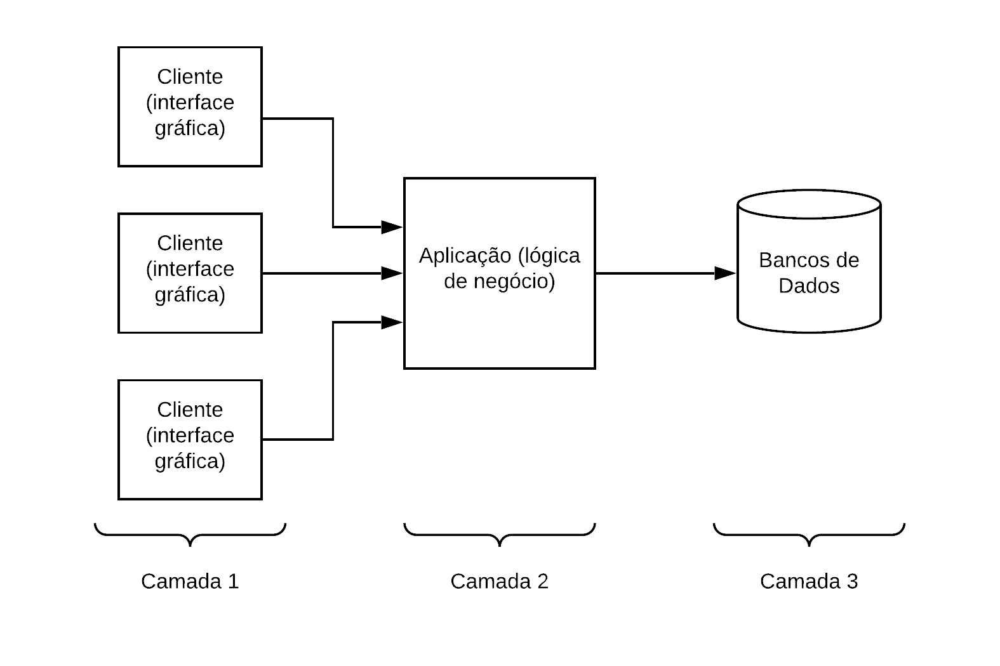{width=65%}

Em um sistema três camadas, a camada de aplicação pode ter diversos
módulos, incluindo uma fachada, para facilitar o acesso ao sistema pelos
clientes, e um módulo de persistência, com a função de isolar o banco de
dados dos demais módulos.

Por fim, gostaríamos de mencionar que é possível ter sistemas em **duas
camadas**. Nesses casos, as camadas de interface e de aplicação são
unidas em uma única camada, que executa no cliente. A camada restante
continua sendo o banco de dados. A desvantagem de arquiteturas em duas
camadas é que todo o processamento ocorre nos clientes, que, portanto,
devem ter um maior poder de computação.

## 7.3 Arquitetura MVC

O padrão arquitetural MVC (Model-View-Controller) foi proposto no final
da década de 70 e, em seguida, usado na implementação de Smalltalk-80,
que é considerada uma das primeiras linguagens orientadas a objetos.
Além de utilizarem conceitos de orientação a objetos, programas em
Smalltalk foram pioneiros no uso de interfaces gráficas, com janelas,
botões, scroll bars, mouse, etc. Isso em uma época em que os sistemas
operacionais ofereciam apenas interfaces de linha de comando e os
programas tinham uma interface textual, isto é, as telas eram uma matriz
de caracteres, com, por exemplo, 25 linhas e 80 colunas.

MVC foi o padrão arquitetural escolhido pelos projetistas de Smalltalk
para implementação de interfaces gráficas. Especificamente, MVC define
que as classes de um sistema devem ser organizadas em três grupos:

*   Visão: classes responsáveis pela apresentação da interface gráfica
    do sistema, incluindo janelas, botões, menus, barras de rolagem,
    etc.

*   Controladoras: classes que tratam e interpretam eventos gerados por
    dispositivos de entrada, como mouse e teclado. Como resultado de
    tais eventos, Controladoras podem solicitar uma alteração no
    estado do Modelo ou da Visão. Suponha, por exemplo, uma
    Calculadora. Quando o usuário clica em um botão \"+\", uma classe
    Controladora deve capturar esse evento e chamar um método do
    Modelo. Como um segundo exemplo, quando o usuário clicar no botão
    \"Dark UI\", cabe também a uma classe Controladora solicitar à
    Visão para mudar as cores da interface gráfica para tons mais
    escuros.

*   Modelo: classes que armazenam os dados manipulados pela aplicação e
    que têm a ver com o domínio do sistema em construção. Assim,
    classes de modelo não têm qualquer conhecimento ou dependência
    para classes de Visão e Controladoras. Além de dados, classes de
    modelo podem conter métodos que alteram o estado dos objetos de
    domínio.

Portanto, em uma arquitetura MVC, a interface gráfica é formada por
objetos de visão e por controladores. Porém, em muitos sistemas não
existe uma distinção clara entre Visão e Controladores. Segundo Fowler
([link](https://dl.acm.org/citation.cfm?id=579257), página
331), mesmo a maioria das versões de Smalltalk não separa esses dois
componentes. Por isso, fica mais fácil entender da seguinte forma:

MVC = (Visão + Controladores) + Modelo = Interface Gráfica + Modelo

A próxima figura mostra as dependências entre as classes de uma
arquitetura MVC. A figura primeiro reforça que a interface gráfica é
composta pela Visão e por Controladores. Podemos observar também que a
Interface Gráfica pode depender do Modelo. Porém, classes de Modelo não
têm dependências para classes da Interface Gráfica. Na verdade, podemos
entender a Interface Gráfica como sendo observadora do Modelo. Quando o
estado dos objetos do Modelo é alterado, deve-se atualizar
automaticamente a interface do sistema.

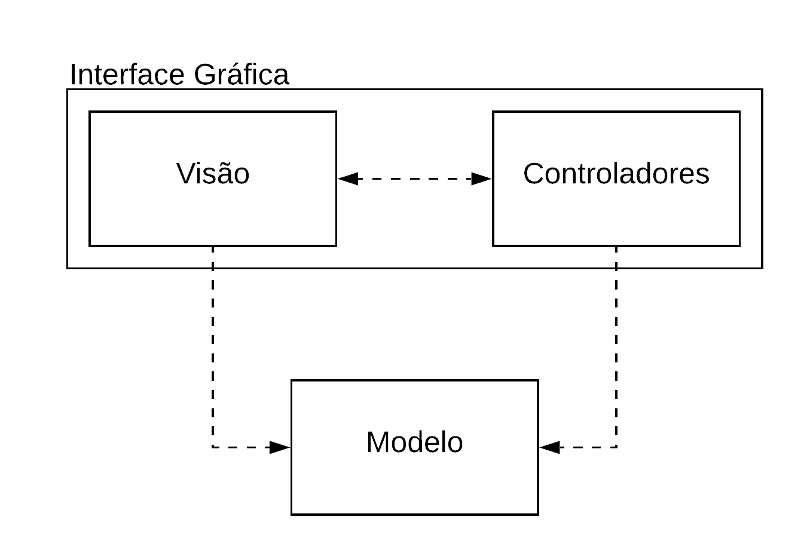{width="40%"}

Dentre as vantagens de arquiteturas MVC, podemos citar:

*   MVC favorece a especialização do trabalho de desenvolvimento. Por
    exemplo, pode-se ter desenvolvedores especialistas na
    implementação de interfaces gráficas, os quais são chamados de
    desenvolvedores de front-end. Por outro lado, desenvolvedores de
    classes de Modelo não precisam conhecer e implementar código de
    interface com usuários.

*   MVC permite que classes de Modelo sejam usadas por diferentes
    Visões, como ilustrado na próxima figura. Neste exemplo, um objeto
    de Modelo armazena dois valores: hora e minutos. Esses dados são
    apresentados em duas visões diferentes. Na primeira, como um
    relógio analógico. Na segunda, como um relógio digital.

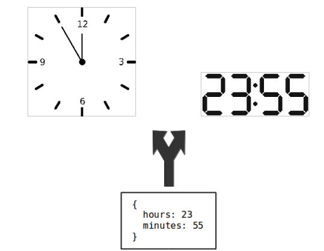{width="30%"}

*   MVC favorece testabilidade. Como veremos no próximo capítulo, é mais
    fácil testar objetos não-visuais, isto é, não relacionados com a
    implementação de interfaces gráficas. Por isso, ao separar objetos
    de apresentação de objetos de Modelo, fica mais fácil testar esses
    últimos.

Vamos concluir com um resumo sobre MVC, na visão de Fowler e Beck
([link](https://dl.acm.org/citation.cfm?id=311424), Cap.
12, pág. 370):

O coração e a parte mais preciosa de MVC está na separação entre
código de interface com o usuário (a Visão, também chamada de
apresentação) e a lógica do domínio (o Modelo). As classes de
apresentação implementam apenas a lógica necessária para lidar com a
interface do usuário. Por outro lado, objetos de domínio não incluem
código visual, mas apenas lógica de negócios. Isso separa duas partes
complexas de sistemas de software em partes que são mais fáceis de se
modificar. Também permite várias apresentações da mesma lógica de
negócio.

💡**Pergunta Frequente**: **Qual a diferença entre MVC e três camadas?**
A resposta vai ser um pouco longa e vamos nos basear na evolução
histórica dessas arquiteturas:

*   Como comentamos, MVC surgiu no final da década de 70, para ajudar na
    construção de interfaces gráficas. Isto é, aplicações que incluem
    uma interface com janelas, botões, caixas de texto, etc. Como
    exemplo, podemos citar um pacote de escritório, com aplicações
    como Word, Excel e Powerpoint, no caso do sistema operacional
    Windows.

*   Na década de 90, as tecnologias de redes, sistemas distribuídos e
    bancos de dados se tornaram comuns. Viabilizou-se então a
    construção de aplicações distribuídas com três camadas. Nesse
    caso, MVC pode ser usado na implementação da camada de interface,
    que pode, por exemplo, ser uma aplicação nativa em Windows,
    implementada usando-se linguagens como Visual Basic ou Java (neste
    último caso, usando-se frameworks como Swing). Resumindo, a
    aplicação, como um todo segue, uma arquitetura em três camadas,
    mas usa MVC na camada de interface com o usuário.

*   No início dos anos 2000, a Web se popularizou e a interface das
    aplicações migrou para HTML e, depois, para HTML e JavaScript. A
    confusão entre os termos MVC e três camadas surgiu então nessa
    época, principalmente devido ao aparecimento de frameworks para
    implementação de sistemas Web que se denominaram frameworks MVC.
    Como exemplo, podemos citar Spring (para Java), Ruby on Rails,
    Django (para Python) e CakePHP. Na verdade, esses frameworks
    expandiram e adaptaram o conceito de MVC para Web. Por exemplo,
    eles forçam a organização de um sistema Web em três partes (veja
    também na próxima figura): visão, composta por páginas HTML;
    controladores, que processam uma solicitação e geram uma nova
    visão como resposta e modelo, que é a camada que persiste os dados
    em um banco de dados.

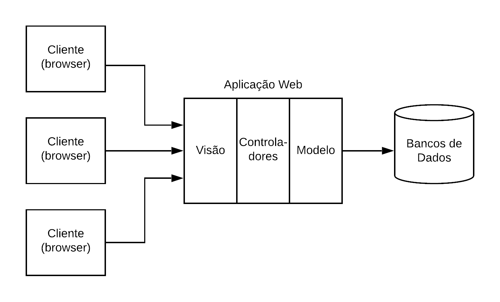{width=55%}

Logo, apesar de sistemas Web serem parecidos com sistemas três camadas,
os frameworks Web mais populares optaram por usar termos típicos de MVC
para nomear seus componentes. Portanto, a melhor maneira de responder à
pergunta é afirmar que existem duas vertentes de sistemas MVC: a
vertente clássica, que surgiu com Smalltalk-80 e a vertente Web, que se
tornou comum na década de 90 e início dos anos 2000. Essa última
vertente lembra bastante sistemas três camadas.

### Exemplo: Single Page Applications

Em uma aplicação Web tradicional, com formulários, menus, botões, etc,
toda vez que o usuário gera um evento — por exemplo, clica em um
botão \"Gravar\" — ocorre uma interação entre o navegador e o
servidor Web. Isto é, o navegador envia informações para o servidor Web,
que as processa e devolve uma nova página para ser exibida para o
usuário. Essas aplicações são então menos interativas e responsivas,
pois sempre existe o atraso da comunicação entre navegador e servidor
Web.

Recentemente, surgiu um novo tipo de sistema Web, chamado de **Single
Page Applications (SPAs)**. Essas aplicações são mais parecidas com
aplicações desktop do que com aplicações Web tradicionais. Ao se entrar
em uma SPA, ela carrega para o navegador todo o código, incluindo
páginas HTML e scripts em CSS e JavaScript. Com isso, apesar de usar um
navegador, o usuário tem a impressão de que ele está usando uma
aplicação local, pois não ocorre mais uma atualização da página do
navegador toda vez que ele gera certos eventos. Diversas aplicações
modernas são SPAs, sendo o GMail, provavelmente, o exemplo mais
conhecido. Evidentemente, continua existindo uma parte da aplicação no
servidor, com a qual a SPA comunica-se frequentemente. Por exemplo,
quando chega um novo e-mail o GMail atualiza a lista de mensagens na
caixa de entrada. Para que isso ocorra de forma automática, a
comunicação entre a SPA e a aplicação servidora deve ser assíncrona.

Existem diversos frameworks — todos eles em JavaScript — para
implementação de SPAs. A seguir, mostramos um exemplo de código usando
Vue.js, que é um desses frameworks.

```
<html>

<script src="https://cdn.jsdelivr.net/npm/vue"></script>

<body>

<h3>Uma Simples SPA</h3>

<div id="ui">
  Temperatura: {{ temperatura }}
  <p><button v-on:click="incTemperatura">Incrementa</button></p>
</div>

<script>
var model = new Vue({
  el: '#ui',
  data: {
    temperatura: 60
  },
  methods: {
    incTemperatura: function() {
      this.temperatura++;
    }
  }
})
</script>

</body>

</html>
```

Essa aplicação apresenta uma temperatura na tela do navegador e um botão
para incrementá-la (veja figura a seguir).

{width="27%"}

👨‍💻 **Código Fonte**: O código do exemplo está disponível neste
[link](https://gist.github.com/mtov/ac1120c5b3e0a85d39bb7b05d20ee307).
Se quiser executar a aplicação no seu navegador, basta usar esse
[link](https://engsoftmoderna.info/examples/vue.html).

O interessante é que SPAs seguem uma arquitetura parecida com MVC. No
exemplo mostrado, a interface da SPA, contendo visão e controle, é
implementada em HTML, mais precisamente no código delimitado pela tag
\<div\>. O modelo é implementado em JavaScript, usando-se Vue.js. O
código do modelo está delimitado pela tag \<script\>.

Um segundo ponto interessante é que o framework Vue.js se encarrega de
propagar para a visão qualquer alteração no modelo. Por exemplo, quando
o método incTemperatura é executado, o valor da temperatura é
automaticamente atualizado na interface. O processo contrário também é
verdadeiro, apesar de não ser exercitado em nosso exemplo, que é bem
simples. Esse recurso de frameworks para construção de SPAs é chamado de
**two way data binding**.

## 7.4 Microsserviços

Como discutimos no Capítulo 2, métodos ágeis preconizam iterações
rápidas, com entregas frequentes de novas releases, a fim de obter
feedback e, se for preciso, efetuar mudanças de rumo. Porém, mesmo que
uma empresa adote um método de desenvolvimento ágil — como XP ou
Scrum — ela vai enfrentar um \"gargalo\" arquitetural quando
precisar lançar novas releases de um produto de forma frequente.

Esse gargalo ocorre porque sistemas, via de regra, seguem em tempo de
execução uma arquitetura monolítica. Ou seja, mesmo que o
desenvolvimento tenha sido particionado em módulos M1, M2, M3, ..., Mn,
em tempo de execução esses módulos são executados, pelo sistema
operacional, como um processo único. Assim, todos os módulos
compartilham o mesmo espaço de endereçamento. Em outras palavras, em
tempo de execução o sistema é um grande **monolito**, como ilustra a
próxima figura.

{width="35%"}

Em um monolito, sempre existe o risco de que uma mudança realizada por
um time T em um módulo Mi cause um efeito colateral em um módulo Mj. Por
exemplo, Mi e Mj podem compartilhar uma variável global ou um atributo
estático. Uma mudança nessa variável, realizada em Mi, pode comprometer
o funcionamento de Mj. Na realidade, esse risco é maior do que um leitor
iniciante em desenvolvimento de sistemas pode imaginar.

Para evitar que os clientes sejam surpreendidos com bugs inesperados em
seus sistemas, as empresas que usam arquiteturas monolíticas adotam um
processo rigoroso e \"burocrático\" para o lançamento de novas releases.
Esse processo pode incluir até mesmo testes manuais antes da liberação
do sistema para produção. Por testes manuais, queremos dizer um testador
usar as funcionalidades mais críticas do sistema, de forma a simular uma
sessão de uso por um cliente final.

Para resolver esse gargalo — o desenvolvimento passou a ser ágil,
mas a entrada em produção permanece burocrática —, recentemente,
algumas empresas passaram a migrar os seus monolitos para uma
arquitetura baseada em **microsserviços**. A ideia é simples: certos
grupos de módulos são executados em processos independentes, sem
compartilhamento de memória. Ou seja, o sistema é decomposto em módulos
não apenas em tempo de desenvolvimento, mas também em tempo de execução.
Com isso, as chances de que mudanças em um módulo causem problemas em
outros módulos são menores.

Quando os módulos são separados em processos distintos não há mais
possibilidade de que um módulo acesse um recurso interno de outro
módulo, como uma variável global, um atributo estático ou uma interface
interna. Em vez disso, por construção, toda comunicação tem que ocorrer
via interfaces públicas dos módulos. Assim, microsserviços são um
instrumento para garantir que os times de desenvolvimento somente usem
interfaces públicas de outros sistemas. A obediência à essa regra é
garantida pelo sistema operacional.

A próxima figura mostra uma versão baseada em microsserviços do nosso
exemplo. Nela, continuam existindo nove módulos. Mas eles são executados
por 6 processos independentes, representados pelos quadrados ou
retângulos em volta dos módulos. Os módulos M1, M2, M3 e M6 são
executados, cada um deles, em um processo independente. Os módulos M4 e
M5 são executados em um quinto processo. Por fim, os módulos M7, M8 e M9
são executados, em conjunto, em um sexto processo.

{width=35%}

Até esse ponto da explicação, usamos o termo processo, mas o nome do
padrão se refere a eles como **serviços**. Ainda, os serviços são micro
porque não implementam funcionalidades complexas. Lembre-se que eles são
desenvolvidos por times ágeis, que como dissemos no Capítulo 2, são
times pequenos, com cerca de cinco desenvolvedores, por exemplo.
Consequentemente, times pequenos não têm capacidade para implementar
grandes serviços.

Uma segunda vantagem de microsserviços é **escalabilidade**. Quando um
monolito enfrenta problemas de performance, uma solução consiste em
disponibilizar instâncias do sistema em máquinas diferentes, como mostra
a próxima figura. Essa solução é chamada de **escalabilidade
horizontal**. Por exemplo, ela permite dividir os clientes do sistema
entre as duas instâncias mostradas na figura. Como se trata de um monolito, 
as duas instâncias são idênticas, isto é, possuem os mesmos módulos.

{width=30%} 
{width=30%}
 

Porém, os problemas de performance podem ser causados por serviços
específicos; por exemplo, apenas pelo serviço de autenticação de
usuários. Então, microsserviços permitem replicar apenas os componentes
diretamente relacionados com os problemas de performance. A próxima
figura mostra uma nova instalação do nosso sistema baseado em
microsserviços. O segundo servidor que foi disponibilizado inclui apenas
instâncias do serviço M1. A suposição é que M1 é responsável pela maior
parte dos problemas de performance da instalação inicial. Na primeira
instalação, tínhamos uma única instância de M1. Agora, temos seis
instâncias, todas elas em um novo servidor.

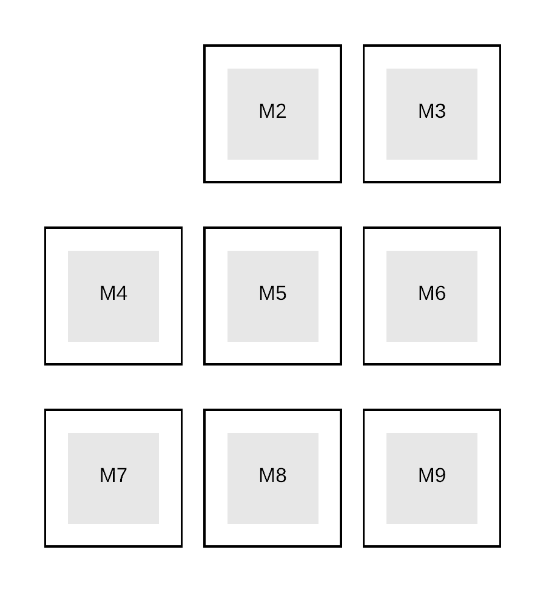{width=30%}
{width=30%}
  
Escalabilidade horizontal de microsserviços. O segundo servidor possui
apenas instâncias do microsserviço M1.

Até o momento, listamos duas vantagens de microsserviços: (1) eles
permitem a evolução mais rápida e independente de um sistema, permitindo
que cada time tenha seu próprio regime de liberação de novas releases;
(2) eles permitem escalar um sistema em um nível de granularidade mais
fino do que é possível com monolitos. Mas existem pelo menos mais duas
vantagens:

*   Como os microsserviços são autônomos e independentes eles podem ser
    implementados em tecnologias diferentes, incluindo linguagens de
    programação, frameworks e bancos de dados. O microsserviço de
    cadastro de clientes em um sistema de comércio eletrônico, por
    exemplo, pode ser implementado em Java com um banco de dados
    relacional. Já o microsserviço de recomendação de novas compras
    pode ser implementado em Python com um banco de dados NoSQL.

*   Quando se usa um monolito, falhas são totais. Se o banco de dados
    cair, todos os serviços ficam fora do ar. Por outro lado, em
    arquiteturas baseadas em microsserviços podemos ter **falhas
    parciais**. Por exemplo, suponha que o microsserviço de
    recomendação de compras do exemplo do item anterior fique fora do
    ar. Os clientes ainda conseguirão pesquisar por produtos, fazer
    compras, etc. Mas eles irão receber uma mensagem na área de
    recomendação da página dizendo que as recomendações estão
    desabilitadas; ou então, essa área ficará vazia; ou ainda, ela não
    será apresentada para os usuários durante o período em que o
    microsserviço de recomendações estiver fora do ar.

Arquiteturas baseadas em microsserviços tornaram-se possíveis devido ao
aparecimento de plataformas de **computação em nuvem**. Com essas
plataformas, empresas não precisam mais comprar e manter hardware e
software básico, como sistema operacional, bancos de dados e servidores
Web. Em vez disso, elas podem alugar uma máquina virtual em uma
plataforma de computação em nuvem e pagar por hora de utilização da
máquina. Com isso, fica mais fácil escalar um microsserviço
horizontalmente, acrescentando novas máquinas virtuais.

📚 **Aprofundamento**: Microsserviços constituem um exemplo de aplicação
da **Lei de Conway**. Formulada em 1968 por Melvin Conway, ela é uma das
leis empíricas sobre desenvolvimento de software, assim como a Lei de
Brooks, que estudamos no Capítulo 1. A Lei de Conway afirma o seguinte:
empresas tendem a adotar arquiteturas de software que são cópias de suas
estruturas organizacionais. Em outras palavras, a arquitetura dos
sistemas de uma empresa tende a espelhar seu organograma. Por isso, não
é coincidência que microsserviços sejam usados, principalmente, por
grandes empresas de Internet que possuem centenas de times de
desenvolvimento distribuídos em diversos países. Além de
descentralizados, esses times são autônomos e sempre incentivados a
produzir inovações.

### Gerenciamento de Dados

Pelo menos na sua forma pura, microsserviços devem ser autônomos também
do ponto de vista de dados. Isto é, eles devem gerenciar os dados de que
precisam para prover o seu serviço. Logo, o cenário ilustrado pela
figura da esquerda a seguir — no qual dois microsserviços
compartilham o mesmo banco de dados — não é recomendável em uma
arquitetura baseada em microsserviços. O ideal é que M1 e M2 sejam
independentes também do ponto de vista de bancos de dados, com mostrado
na figura da direita. O principal motivo é que quando se têm um único
banco de dados ele também pode se transformar em um gargalo à evolução
do sistema.

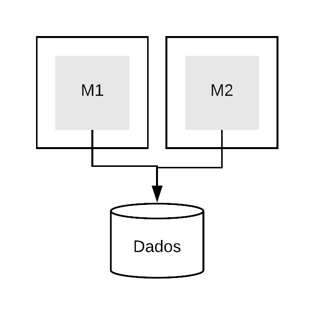{width=27%}   

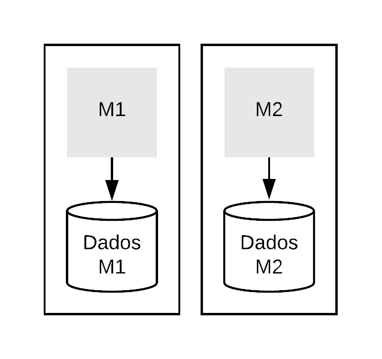{width=27%}
    

Por exemplo, equipes e arquiteturas tradicionais de desenvolvimento
costumam ter um administrador de dados, a quem cabe cuidar das tabelas
do banco de dados. Qualquer mudança no banco de dados — como a
criação de uma coluna em uma tabela — precisa de aprovação do
administrador de dados. Logo, essa autoridade central tem que conciliar
os interesses, muitas vezes conflitantes, das diversas equipes de
desenvolvimento. Por isso, suas decisões podem se tornar lentas e
burocráticas, atrasando a evolução do sistema.

### Quando não usar microsserviços?

Até esse momento, apresentamos as vantagens e benefícios de
microsserviços. Mas é importante dizer que essa arquitetura é mais
complexa do que uma arquitetura monolítica. O motivo é que
microsserviços são processos independentes, isto é, eles por construção
dão origem a sistemas distribuídos. Logo, ao usar microsserviços, temos
que enfrentar todos os desafios que aparecem quando se implementa um
sistema distribuído. Dentre eles, podemos citar:

*   Complexidade: quando dois módulos executam em um mesmo processo, a
    comunicação entre eles é por meio de chamadas de métodos. Quando
    esses módulos estão em máquinas diferentes, a comunicação entre
    eles deve usar algum protocolo de comunicação, como **HTTP/REST**.
    Ou seja, os desenvolvedores terão que dominar e usar um conjunto
    de tecnologias para comunicação em redes.

*   Latência: a comunicação entre microsserviços também envolve um
    atraso maior, que chamamos de **latência**. Quando um cliente
    chama um método em um sistema monolítico, a latência é mínima. Por
    exemplo, é raro um desenvolvedor deixar de usar uma chamada de
    método apenas para melhorar o desempenho de seu sistema. Porém,
    esse cenário muda quando o serviço chamado está em uma outra
    máquina, talvez do outro lado do planeta no caso de uma empresa
    global. Nessas situações, existe um custo de comunicação que não é
    desprezível. Qualquer que seja o protocolo de comunicação usado,
    essa chamada terá que passar pelo cabo da rede — ou pelo ar e
    pela fibra ótica — até chegar à máquina de destino.

*   Transações Distribuídas: Como vimos, microsserviços devem ser
    autônomos também do ponto de vista de dados. Isso torna mais
    complexo garantir que operações que operam em dois ou mais bancos
    de dados sejam atômicas, isto é, ou elas executam com sucesso em
    todos os bancos ou então falham. Suponha, por exemplo, dois
    microsserviços de pagamento via cartão de crédito, que vamos
    chamar de X e Y. Suponha que uma loja virtual permita dividir o
    valor da compra entre os dois cartões. Por exemplo, uma compra de
    R$ 2.000,00 pode ser paga debitando-se R$ 1.500,00 no cartão X e
    R$ 500,00 no cartão Y. Porém, essas transações devem ser
    atômicas: ou os dois cartões são debitados ou nenhum deles é
    debitado. Por isso, em arquiteturas baseadas em microsserviços,
    protocolos de transações distribuídas, como **two phase commit**,
    podem ser necessários para garantir uma semântica de transações em
    operações que escrevem em mais de um banco de dados.

## 7.5 Arquiteturas Orientadas a Mensagens

Neste tipo de arquitetura, a comunicação entre clientes e servidores é
mediada por um terceiro serviço que têm a única função de prover uma
**fila de mensagens**, como mostra a próxima figura.

{width="70%"}

Os clientes atuam como produtores de informações, isto é, eles inserem
mensagens na fila. E os servidores atuam como consumidores de mensagens,
isto é, eles retiram mensagens da fila e processam a informação contida
nelas. Uma mensagem é um registro (ou um objeto) com um conjunto de
dados. E uma fila de mensagens é uma estrutura do tipo FIFO (*first in,
first out*), isto é, a primeira mensagem a entrar na fila é a primeira a
ser consumida pelo servidor.

Com o uso de filas de mensagens, a comunicação pelo lado do cliente
torna-se **assíncrona**, pois uma vez que a informação seja colocada na
fila, o cliente está liberado para continuar seu processamento. Por
isso, é importante que o serviço de mensagens seja instalado em uma
máquina estável e com alto poder de processamento. Também é importante
que a fila de mensagens seja persistente. Se o servidor que gerencia a
fila cair, os dados não podem ser perdidos. Como filas de mensagens são
muito usadas na construção de sistema distribuídos, existem soluções
prontas no mercado. Ou seja, provavelmente você não vai implementar sua
própria fila de mensagens, mas usar soluções de empresas conhecidas ou
então mantidas por fundações de desenvolvimento de sistemas de código
aberto. Algumas vezes, filas de mensagens são chamadas também de
**brokers** de mensagens.

Além de permitirem comunicação assíncrona entre clientes e servidores,
filas de mensagens viabilizam duas formas de desacoplamento entre os
componentes de uma aplicação distribuída:

*   **Desacoplamento no espaço**: clientes não precisam conhecer os
    servidores e vice-versa. Em outras palavras, o cliente é
    exclusivamente um produtor de informações. Mas ele não precisa
    saber quem vai consumir essa informação. O raciocínio inverso vale
    para servidores.

*   **Desacoplamento no tempo**: clientes e servidores não precisam
    estar simultaneamente disponíveis para se comunicarem. Se o
    servidor estiver fora do ar, os clientes podem continuar
    produzindo mensagens e colocando-as na fila. Quando o servidor
    voltar a funcionar, ele irá processar as mensagens.

Desacoplamento no espaço torna soluções baseadas em filas de mensagens
bastante flexíveis. Os times de desenvolvimento — tanto do sistema
cliente, como do sistema servidor — podem trabalhar e evoluir seus
sistemas com autonomia. Atrasos de um time não travam a evolução de
outros times, por exemplo. Para isso, basta que o formato das mensagens
permaneça estável ao longo do tempo. Já desacoplamento no tempo torna a
solução robusta a falhas. Por exemplo, quedas do servidor não têm
impacto nos clientes. No entanto, é importante que o broker de mensagens
seja estável e capaz de armazenar uma grande quantidade de mensagens.
Para garantir a disponibilidade desses brokers, eles costumam ser
gerenciados pelos times de infraestrutura básica das empresas.

Filas de mensagens permitem também escalar mais facilmente um sistema
distribuído. Para isso, basta configurar múltiplos servidores consumindo
mensagens da mesma fila, como mostra a próxima figura.

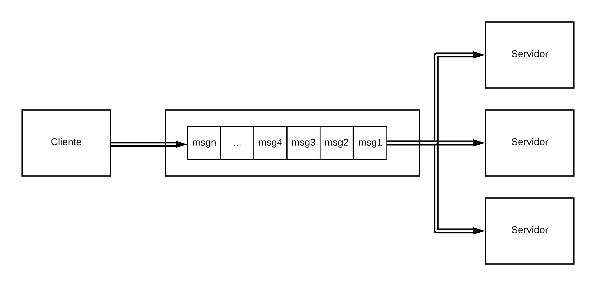{width=70%}

### Exemplo: Empresa de Telecomunicações

Suponha que uma empresa de telecomunicações tenha dois sistemas
principais: vendas e engenharia. O sistema de vendas é responsável pela
interação com os clientes da empresa, incluindo vendas de pacotes de
voz, dados e TV a cabo. Por outro lado, o sistema de engenharia é
responsável por ativar e configurar os serviços contratados, interagindo
para isso com os equipamentos da empresa, tais como centrais
telefônicas, estações de celulares, roteadores, etc. Portanto, quando um
serviço é contratado no sistema de vendas, ele tem que ser provisionado
no sistema de engenharia.

Essa empresa de telecomunicações pode usar uma fila de mensagens para
mediar a comunicação entre o sistema de vendas e o sistema de
engenharia. Ao se vender um novo pacote de serviços, o sistema de vendas
irá depositar uma mensagem na fila de mensagens, com as informações do
pacote. Cabe ao sistema de engenharia ler essa mensagem e ativar o
serviço que foi vendido.

Ao optar por uma fila de mensagens, a integração entre os sistemas de
vendas e de engenharia pode não ocorrer em tempo real. Por exemplo, se o
serviço de engenharia estiver ocupado, com várias ativações complexas de
serviços pendentes, pode demorar um pouco até que um determinado serviço
seja ativado. Por outro lado, a solução com fila de mensagens permite
ativar os serviços mais rapidamente do que por meio de uma solução
**batch**. Nesse tipo de solução, o sistema de vendas geraria ao final
de cada dia um arquivo com todos os pacotes vendidos. Esse arquivo seria
lido e processado durante a noite pelo sistema de engenharia. Portanto,
um cliente poderia ter que esperar quase 24 horas para ter seu serviço
ativado.

## 7.6 Arquiteturas Publish/Subscribe

Em arquiteturas publish/subscribe, as mensagens são chamadas de
**eventos**. Os componentes da arquitetura são chamados de
**publicadores** (*publishers*) e **assinantes** (*subscribers*) de
eventos. Publicadores produzem eventos e os publicam no serviço de
publish/subscribe, que normalmente executa em uma máquina separada.
Assinantes devem previamente assinar eventos de seu interesse. Quando um
evento é publicado, os seus assinantes são notificados, conforme mostra
a próxima figura.

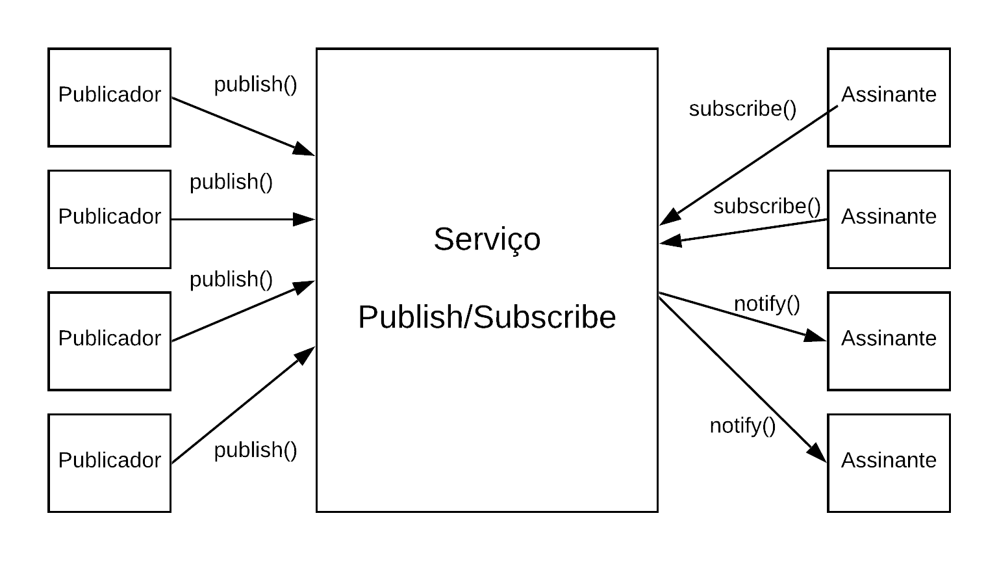{width=55%}

Assim como ocorre quando se usa filas de mensagens, arquiteturas
publish/subscribe também oferecem desacoplamento no espaço e no tempo.
No entanto, existem duas diferenças principais entre publish/subscribe e
filas de mensagens:

*   Em publish/subscribe, um evento gera notificações em todos os seus
    assinantes. Por outro lado, em filas de mensagens, as mensagens
    são sempre consumidas — isto é, retiradas da fila — por um
    único servidor. Portanto, em publish/subscribe temos um estilo de
    comunicação de 1 para *n*, também conhecida como **comunicação em
    grupo**. Já em filas de mensagens, a comunicação é 1 para 1,
    também chamada de **comunicação ponto-a-ponto**.

*   Em publish/subscribe, os assinantes são notificados assincronamente.
    Primeiro, eles assinam certos eventos e, então, continuam seu
    processamento. Quando o evento de interesse ocorre, eles são
    notificados por meio da execução de um determinado método. Por
    outro lado, quando se usa uma fila de mensagens, os servidores
    — isto é, os consumidores das mensagens — têm que
    \"puxar\" (*pull*) as mensagens da fila.

Em alguns sistemas publish/subscribe, eventos são organizados em
**tópicos**, que funcionam como categorias de eventos. Quando um
publicador produz um evento, ele deve informar seu tópico. Assim,
clientes não precisam assinar todos eventos que ocorrem no sistema, mas
apenas eventos de um certo tópico.

Arquiteturas publish/subscribe são, às vezes, chamadas de **arquiteturas
orientadas a eventos**. O serviço de publish/subscribe, às vezes, é
chamado também de **broker de eventos**, pois ele funciona como um
barramento por onde devem trafegar todos os eventos. É importante
mencionar ainda que um sistema publish/subscribe lembra o padrão de
projeto **Observador**, que estudamos no Capítulo 6. No entanto,
publish/subscribe é uma solução para implementação de sistemas
distribuídos. Ou seja, produtores e assinantes são processos distintos
e, na maioria das vezes, distribuídos. Por outro lado, o padrão de
projeto Observador não foi proposto no contexto de arquiteturas
distribuídas.

### Exemplo: Companhia Aérea

Vamos agora usar os sistemas de uma companhia aérea para ilustrar uma
arquitetura publish/subscribe. Suponha que essa companhia tenha um
sistema de vendas, que é usado pelos clientes para comprar passagens
aéreas. Após efetuar uma venda, esse sistema pode gerar um evento, com
todos os dados da venda (data, horário, número do vôo, dados do
passageiro, etc). A figura a seguir ilustra a arquitetura proposta para
o sistema.

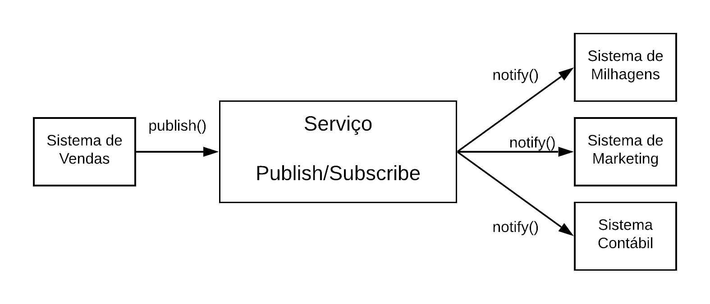{width=70%}

O evento \"venda\" será então assinado por três sistemas da companhia
aérea: (1) sistema de milhagens, pois as milhas relativas à passagem
devem ser creditadas na conta do passageiro; (2) sistema de marketing,
que pode usar os dados da venda para fazer ofertas para o cliente, como
aluguel de carros, promoção para classe executiva, etc; (3) Sistema de
contabilidade, pois a venda que foi realizada precisa ser incluída na
contabilidade da empresa.

Essa arquitetura tem as seguintes características interessantes: (1)
comunicação em grupo, pois o mesmo evento é assinado por três sistemas;
(2) desacoplamento no espaço, pois o sistema de vendas não tem
conhecimento dos sistemas interessados nos eventos que ele publica; (3)
desacoplamento no tempo, pois o sistema de publish/subscribe reenvia os
eventos caso os sistemas assinantes estejam fora do ar; (4) notificação
assíncrona, pois os assinantes são notificados assim que um evento
ocorre; isto é, eles não precisam consultar periodicamente o sistema
publish/subscribe sobre a ocorrência dos eventos de interesse.

## 7.7 Outros Padrões Arquiteturais

**Pipes e Filtros** é um tipo de arquitetura orientada a dados, na qual
os programas \-- chamados de **filtros** — têm como função processar
os dados recebidos na entrada e gerar uma nova saída. Os filtros são
conectados por meio de **pipes**, que agem como buffers. Isto é, pipes
são usados para armazenar a saída de um filtro, enquanto ela não é lida
pelo próximo filtro da sequência. Com isso, os filtros não precisam
conhecer seus antecessores e sucessores, o que torna esse tipo de
arquitetura bastante flexível, permitindo as mais variadas combinações
de programas. Além disso, por construção, filtros podem ser executados
em paralelo. O exemplo clássico de arquitetura baseada em pipes e
filtros são os comandos de sistemas Unix. Por exemplo, a linha de
comando:

```
ls | grep csv | sort
```

especifica a execução de três comandos (filtros) que são conectados por
dois pipes (barras verticais). No caso dos comandos Unix, as entradas e
saídas são sempre arquivos texto.

**Cliente/Servidor** é um uma arquitetura muito usada na implementação
de serviços básicos de rede. Clientes e servidores são os dois únicos
módulos desse tipo de arquitetura e eles se comunicam por meio de uma
rede. Os clientes solicitam serviços ao módulo servidor e aguardam o
processamento. Arquiteturas cliente/servidor são usadas para implementar
serviços como os seguintes: (1) serviço de impressão, que possibilita
que clientes imprimam em uma impressora remota, que não está fisicamente
conectada à máquina deles; (2) serviço de arquivos, que possibilita que
clientes acessem o sistemas de arquivos (isto é, o disco) de uma máquina
servidora; (3) serviço de bancos de dados, que permite que clientes
acessem um banco de dados instalado em uma outra máquina; (4) serviço
Web, que permite que clientes (navegadores) acessem recursos (páginas
HTML) armazenadas e providas por um servidor Web.

Arquiteturas **peer-to-peer** são arquiteturas distribuídas nas quais os
módulos da aplicação podem desempenhar tanto o papel de cliente, como o
papel de servidor. Em outras palavras, esses módulos — chamados de
**pares** — são tanto consumidores como provedores de recursos. Por
exemplo, BitTorrent é um protocolo peer-to-peer para compartilhamento de
arquivos na Internet. Aplicações que implementam o protocolo podem tanto
prover arquivos como realizar o download de arquivos disponíveis na
rede.

## 7.8 Anti-padrões Arquiteturais

Vamos encerrar com a descrição de um **anti-padrão** arquitetural, isto
é, uma organização de sistemas que não é recomendada. Talvez, o mais
conhecido anti-padrão é chamado de **big ball of mud** (ou \"grande bola
de lama\"). Esse anti-padrão — proposto por Brian Foote e Joseph
Yoder ([link](https://joeyoder.com/PDFs/mud.pdf)) —
descreve sistemas nos quais qualquer módulo comunica-se com praticamente
qualquer outro módulo, como mostra a próxima figura.

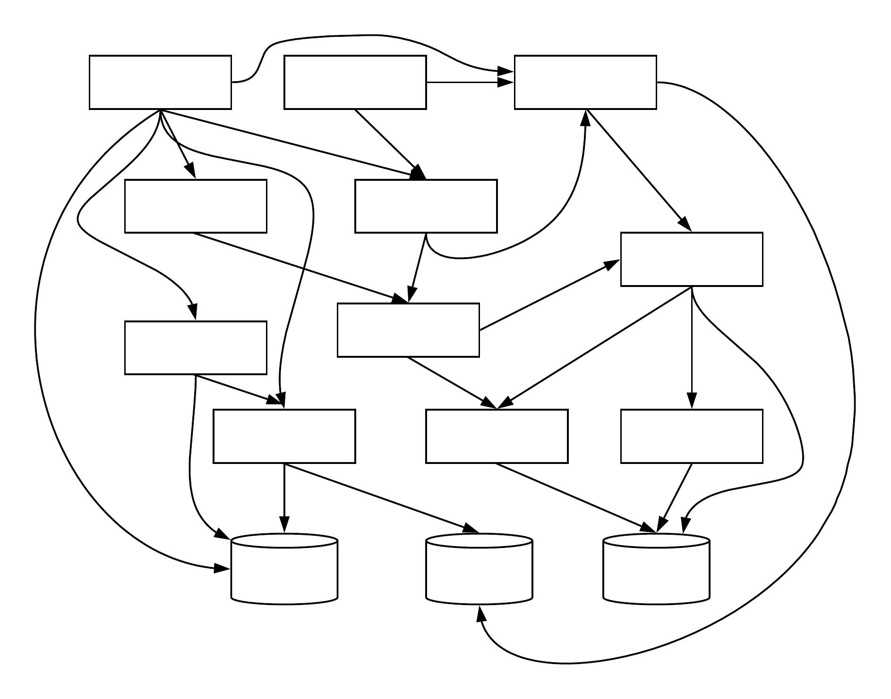{width=40%}

Ou seja, um \"big ball of mud\" não possui uma arquitetura definida. Em
vez disso, o que existe é uma explosão no número de dependências, que dá
origem a um espaguete de código. Consequentemente, a manutenção do
sistema torna-se muito difícil e arriscada.

🌎 **Mundo Real**: Em um artigo publicado em 2009 na revista IEEE
Software ([link](https://doi.org/10.1109/MS.2009.42)),
Santonu Sarkar e mais cinco colegas — na época consultores da
empresa indiana InfoSys — descrevem uma experiência de modularização
de um grande sistema bancário. O sistema nasceu no final da década de 90
e desde então aumentou seu tamanho em 10 vezes: passou de 2.5 milhões
para mais de 25 milhões de linhas de código! Segundo os autores, os
times de desenvolvimento do sistema contavam com \"várias centenas de
engenheiros\". Apesar de não usarem o termo, o artigo caracteriza a
arquitetura desse sistema bancário como uma \"big ball of mud\". Por
exemplo, eles mencionam que apenas um diretório, chamado \"sources\",
possuía quase 15 mil arquivos. Em seguida, os autores analisam o
problema que era manter esse sistema: (1) o tempo de aprendizado de
novos engenheiros só aumentava, passando de 3 para 7 meses, no intervalo
de cinco anos; (2) frequentemente, a correção de bugs introduzia novos
bugs no sistema; (3) o tempo de implementação de novas funcionalidades,
mesmo que simples, também estava aumentando muito.

Pode parecer que sistemas como esse — analisado no artigo da IEEE
Software — são exceções. Porém, eles são mais comuns do que se pode
imaginar. E a origem do problema reside na transformação do código em
uma \"big ball of mud\". De forma interessante, os autores citam que o
banco tentou contornar o problema adotando práticas como documentação
detalhada, revisões de código e programação em pares. Porém, todas se
mostraram incapazes de atenuar os problemas causados pela arquitetura em
forma de \"big ball of mud\".

## Vídeos Complementares

Para complementar o conteúdo deste capítulo, recomendamos dois vídeos
relacionados com microsserviços:

*   Um tutorial sobre microsserviços
    ([link](https://youtu.be/wgdBVIX9ifA)), apresentado
    por Martin Fowler na conferência GOTO 2015, com duração de 26
    minutos.

*   Uma palestra sobre a arquitetura de microsserviços adotada pela
    Netflix ([link](https://youtu.be/57UK46qfBLY)),
    realizada por Ruslan Meshenberg, na época diretor de engenharia da
    empresa e apresentada na conferência GOTO 2016, com duração de 49
    minutos.

## Bibliografia

* James Lewis, Martin Fowler. Microservices: a definition of this new
architectural term. 2014.

* Martin Fowler. Patterns of Enterprise Application Architecture,
Addison-Wesley, 2002.

* Martin Fowler. Who Needs an Architect, IEEE Software, 2003.

* Patrick Eugster et al. The many faces of publish/subscribe. ACM
Computing Surveys, 2003.

* Glenn E. Krasner, Stephen T. Pope. A cookbook for using the model-view
controller user interface paradigm in Smalltalk-80. Journal of
Object-Oriented Programming, 1988.

* Kevlin Henney, Frank Buschmann, Douglas C. Schmidt. Pattern-Oriented
Software Architecture: A Pattern Language for Distributed Computing,
Vol. 4, John Wiley & Sons, 2007.

## Exercícios de Fixação

1.  Dada a sua complexidade, sistemas de bancos de dados são componentes
    relevantes na arquitetura de qualquer tipo de sistema. Verdadeiro
    ou falso? Justifique.

2.  Qual a diferença entre classes Controladoras em uma Arquitetura MVC
    tradicional e classes Controladoras de um sistema Web implementado
    usando um framework MVC como Ruby on Rails?

3.  Descreva resumidamente quatro vantagens de microsserviços.

4.  Por que microsserviços não são uma bala de prata? Isto é, descreva
    pelo menos três desvantagens do uso de microsserviços.

5.  Explique o que significa desacoplamento no espaço e desacoplamento
    no tempo. Por que arquiteturas baseadas em filas de mensagens e
    arquiteturas Publish/Subscribe oferecem essa forma de
    desacoplamento?

6.  Quando uma empresa deve considerar o uso de uma arquitetura baseada
    em filas de mensagens ou uma arquitetura publish/subscribe?

7.  Explique o objetivo do conceito de tópicos em uma arquitetura
    publish/subscribe.

8.  (POSCOMP, 2019, adaptado) Marque V ou F.

( ) Mesmo que um dado padrão arquitetural ofereça uma solução para o
problema sendo resolvido, nem sempre ele é adequado. Fatores como
contexto e o sistema de forças que afeta a solução fazem também parte
do processo de avaliação e da escolha de padrões adequados.

( ) Padrão MVC é uma adaptação do padrão arquitetural Camadas. A
Camada Visão lida com a apresentação e a manipulação da interface, a
Camada Modelo organiza os objetos específicos da aplicação, e a Camada
Controle posiciona-se entre estas duas com as regras do negócio.

( ) O padrão Broker é voltado a problemas de ambientes distribuídos.
Sugere uma arquitetura na qual um componente (broker) estabelece uma
mediação que permite um desacoplamento entre clientes e servidores.
